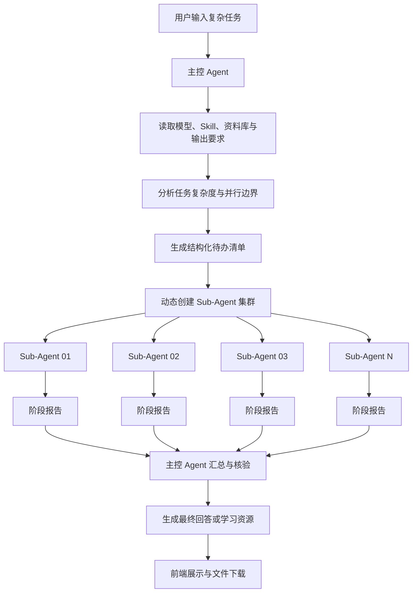

# 长任务模式运行逻辑

## 1. 功能定位

长任务模式用于处理无法通过一次普通对话稳定完成的复杂任务，例如：

- 阅读多份资料并生成综合研究报告；
- 分析论文及其参考文献之间的关系；
- 完成系统设计、代码实现、测试与风险审查；
- 生成结构完整的课程讲义、PPT 或 Word 文档；
- 针对复杂知识点开展资料研究、案例验证和质量核验。

系统采用“一个主控 Agent + 多个动态 Sub-Agent”的协作模式。主控 Agent 负责理解目标、拆分任务、创建 Agent 集群、监控执行、审核阶段结果并生成最终输出；Sub-Agent 只处理被分配的专项任务。

长任务模式中的 Agent 数量和角色不是固定模板。主控 Agent 会根据用户提示词、资料、课程上下文和目标输出，自主决定创建 2～8 个 Sub-Agent。

## 2. 总体架构



## 3. 运行流程

### 3.1 请求接入

前端提交用户问题及当前配置，主要包括：

- 用户问题和学习目标；
- 课程、章节和知识短板；
- 选择的模型供应商及模型；
- 已选择的资料库 PDF；
- 已启用的 Skill；
- 目标资源类型；
- `long_task_mode` 长任务模式开关。

长任务模式默认允许主控 Agent 创建最多 8 个 Sub-Agent。该数量是安全上限，不是固定执行数量。

### 3.2 资料与 Skill 装载

后端首先整理共享上下文：

1. 读取用户问题和目标；
2. 使用 RAG 检索所选 PDF 的相关内容；
3. 装载用户本次启用的 Skill 指令；
4. 确认模型接口、响应速度和目标资源格式；
5. 将以上信息写入共享状态 `LearningState`。

所有 Sub-Agent 都能读取任务所需的共享上下文，但每个 Sub-Agent 只能按照自己的任务边界工作。

### 3.3 主控 Agent 自主规划

主控 Agent 根据当前提示词生成严格的 JSON 任务计划：

```json
{
  "summary": "任务拆解摘要",
  "tasks": [
    {
      "role": "根据任务动态生成的角色名称",
      "task": "该 Agent 的明确工作范围",
      "deliverable": "需要提交的阶段产物"
    }
  ]
}
```

规划过程遵循以下规则：

- 根据任务复杂度自主创建 2～8 个 Sub-Agent；
- 角色名称必须与当前任务相关；
- 子任务应尽量相互独立，适合并行执行；
- 每个子任务必须有明确交付物；
- 避免多个 Agent 重复完成相同工作；
- 覆盖研究、实现、验证、审查或表达中真正需要的环节。

例如：

| 用户任务 | 可能创建的动态 Agent |
|---|---|
| 分析论文和参考文献 | 主论文解析、文献分组研究、证据核验、关系建模、报告设计 |
| 开发一个软件功能 | 需求分析、架构设计、核心实现、测试设计、安全审查 |
| 制作课程汇报 PPT | 内容研究、结构策划、案例设计、视觉规划、质量校对 |
| 复习复杂课程知识 | 概念梳理、例题分析、易错点审查、迁移应用、学习评估 |

如果主控模型没有返回合法 JSON，系统会根据提示词关键词选择对应的降级拆解方案，保证流程仍能继续。

### 3.4 创建 Agent 集群

任务计划确认后，主控 Agent 为每个任务生成：

- 唯一任务编号，例如 `sub-01`；
- 动态 Agent 名称；
- 专业角色；
- 工作范围；
- 预期交付物；
- 共享上下文引用。

只有本次任务真正需要的 Agent 才会创建和显示。未参与当前任务的 Agent 不会出现在界面中。

### 3.5 并行执行

后端使用线程池同时运行多个 Sub-Agent：

```text
主控 Agent
├─ Sub-Agent 01 ── 独立模型请求
├─ Sub-Agent 02 ── 独立模型请求
├─ Sub-Agent 03 ── 独立模型请求
└─ Sub-Agent N  ── 独立模型请求
```

每个 Sub-Agent 使用当前用户选择的同一个模型通道，但具有不同的系统角色和任务提示词。

Sub-Agent 的输出不是最终答案，而是供主控 Agent 使用的阶段报告。阶段报告要求包含：

- 已完成的工作；
- 关键发现；
- 事实依据、示例或验证结果；
- 仍需主控 Agent 注意的问题；
- 对应任务要求的具体交付物。

### 3.6 实时进度

Sub-Agent 内部使用流式模型响应。后端不会把模型的隐藏推理原文发送到前端，而是根据实际已生成的阶段内容上报可审计进度：

```json
{
  "agent": "证据核验 Sub-Agent 03",
  "message": "并行执行：核对关键论断和资料依据",
  "state": "running",
  "kind": "action",
  "progress": 58,
  "meta": [
    "任务编号：sub-03",
    "当前产出：472 字",
    "状态：后台并行执行中"
  ]
}
```

前端根据 SSE 状态事件更新对应 Agent 卡片：

- `pending`：已创建，等待主控 Agent 调用；
- `running`：正在并行执行；
- `done`：阶段报告已经提交；
- 进度条：根据实际生成的阶段内容持续更新；
- 展开卡片：查看任务、角色、执行摘要和阶段产物。

界面展示的是规划思路、执行动作和阶段结论，不直接暴露模型私有的逐字思维链。

### 3.7 阶段报告汇总

所有 Sub-Agent 完成后，主控 Agent 执行以下工作：

1. 收集阶段报告；
2. 按任务编号恢复原始计划顺序；
3. 删除重复内容；
4. 检查不同报告之间的结论冲突；
5. 标记失败或证据不足的子任务；
6. 将有效报告写入共享上下文；
7. 继续生成最终回答或用户选择的学习资源。

如果用户选择了课程讲解、思维导图、练习题、PPT、Word 等功能，阶段报告会作为增强上下文交给对应资源 Agent。

## 4. 故障与降级机制

### 4.1 任务规划失败

如果主控模型未返回合法任务 JSON，系统会根据任务关键词选择降级方案：

- 论文、文献、研究类任务；
- 代码、系统、API、Bug 类任务；
- PPT、文档、汇报类任务；
- 通用复杂任务。

### 4.2 单个 Sub-Agent 失败

单个 Sub-Agent 调用失败时：

- 该 Agent 被标记为执行失败；
- 错误摘要显示在对应卡片中；
- 其他 Agent 继续运行；
- 主控 Agent在汇总阶段进行降级补充。

### 4.3 全部 Sub-Agent 失败

如果所有 Sub-Agent 都失败，系统终止长任务并返回模型接口错误，避免使用无依据的空报告生成最终结果。

### 4.4 GitHub Skill 或资料不可用

外部 Skill、资料库或网络资源不可用时，不影响 Agent 集群基本运行。主控 Agent 会基于用户问题和当前可用上下文继续拆解任务，并明确资料不足。

## 5. 前端交互

### 5.1 开启方式

在首页输入框右侧的模型菜单中开启“长任务模式”。

开启后，主控 Agent 会自主判断需要多少个 Sub-Agent，用户不需要手动设置数量。

### 5.2 Agent 协作视图

协作视图包括：

- 主控 Agent 任务分析；
- 待办清单；
- 实际创建的 Sub-Agent 集群；
- 每个 Agent 的执行状态和进度；
- Agent 之间的任务交接动画；
- 可展开的执行详情；
- 主控 Agent 汇总状态。

未被主控 Agent 调用的角色不会显示。

## 6. 核心数据字段

### 请求字段

| 字段 | 类型 | 说明 |
|---|---|---|
| `long_task_mode` | `boolean` | 是否开启长任务模式 |
| `max_subagents` | `integer` | Sub-Agent 安全上限，默认 8 |
| `resourceTypes` | `string[]` | 最终要生成的资源类型 |
| `fileIds` | `string[]` | 参与 RAG 检索的资料 ID |
| `skill_names` | `string[]` | 本次启用的 Skill |
| `skill_instructions` | `string` | Skill 指令上下文 |

### 状态事件字段

| 字段 | 说明 |
|---|---|
| `agent` | 当前 Agent 名称 |
| `message` | 当前执行动作 |
| `detail` | 可审计的动作摘要 |
| `state` | `pending`、`running` 或 `done` |
| `kind` | `thought`、`team`、`action` 或 `result` |
| `progress` | 当前任务进度 |
| `meta` | 任务编号、交付物和当前产出等信息 |

## 7. 安全边界

- 不向前端发送模型隐藏推理原文；
- 只展示任务计划、动作摘要和阶段产物；
- Sub-Agent 不会自动执行外部命令；
- 导入的第三方 Skill 只作为提示词约束使用；
- 不会把 Skill 文本当作系统命令执行；
- 不伪造未访问的网页、文献、页码或资料来源；
- 并行数量存在上限，防止无限创建任务和失控消耗。

## 8. 性能与成本

长任务模式通常会产生：

```text
1 次主控规划请求
+ N 次并行 Sub-Agent 请求
+ 1 次最终生成请求
+ 可选的资源审核与格式化请求
```

因此长任务模式会增加：

- 模型 Token 消耗；
- API 并发请求数量；
- 总执行时间；
- 模型服务的限流风险。

部署时应根据模型供应商的并发限制配置反向代理超时、后端连接池和账户额度。

## 9. 主要实现位置

| 文件 | 作用 |
|---|---|
| `app/api/schemas.py` | 长任务请求字段 |
| `app/api/routes.py` | 主控规划、并行执行、流式进度和结果汇总 |
| `app/learning/llm.py` | 模型普通调用与流式调用 |
| `app/learning/state.py` | 多 Agent 共享状态 |
| `frontend/src/components/CollaborativeGeneratePage.vue` | 长任务开关、Agent 集群、进度条和详情展示 |
| `frontend/src/types/index.ts` | 前端请求与响应类型 |
