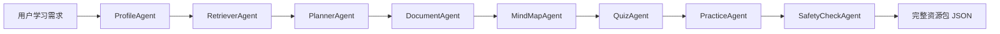

# Agent Workflow

## Agent Responsibilities
- ProfileAgent：抽取专业、年级、学习目标、薄弱点、学习风格和资源偏好。
- RetrieverAgent：基于关键词从 `knowledge_base/database_system` 检索课程资料。
- PlannerAgent：生成分阶段学习路径。
- DocumentAgent：生成 Markdown 讲解文档。
- MindMapAgent：生成 Mermaid mindmap。
- QuizAgent：生成选择、判断、填空、简答、应用题。
- PracticeAgent：生成 SQL 实操案例。
- SafetyCheckAgent：检查教学适用性和知识库依据。
- EvaluatorAgent：分析答题结果并给出后续建议。
