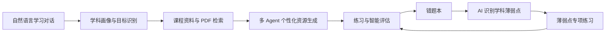

# 智学 AI 项目作品亮点

## 一、作品概述

“智学 AI”是一套面向大学生个性化学习场景设计的多智能体学习平台。项目以“发现学习问题—理解学生差异—调用课程资料—生成个性化资源—练习与评估—沉淀错题—更新薄弱点”为核心闭环，将大语言模型、多智能体协作、检索增强生成、动态学习画像、流式交互和开放 Skill 等能力融合到同一学习空间中。

系统并非只提供通用问答，而是根据学生选择的学科、课程章节、知识短板、学习目标、历史错题和资料库内容组织智能体协作，生成课程讲解、思维导图、练习题、拓展阅读、代码实操、学习路线、PPT 讲解和 Word 学习文档等资源，并通过学习评估和错题反馈持续调整后续内容，实现从“回答一个问题”向“支持完整学习过程”的转变。

## 二、核心亮点

### 1. 以学习闭环为核心，而不是简单封装大模型

传统 AI 问答通常在返回答案后结束，难以持续追踪学生是否真正掌握知识。智学 AI 将学习过程拆分为画像建立、资料检索、内容生成、练习作答、错题沉淀、薄弱点分析和再次训练等连续环节。



该闭环的创新价值在于：学生的错题不只是静态保存记录，而会继续参与薄弱知识点分析和专项题目生成；画像也不只是展示性标签，而是作为后续内容难度、讲解方式和学习建议的重要上下文。

### 2. “主控 Agent + 动态 Sub-Agent”协作架构

系统同时支持普通任务和长任务两种协作方式。

- 普通任务中，系统按照资料检索、Skill 路由、学情分析、任务规划、专项资源生成、质量审核和结果整合等环节协作。
- 长任务中，主控 Agent 会分析任务复杂度和可并行边界，自主决定创建 2～8 个 Sub-Agent，而不是固定展示一组预设角色。
- 不同提示词会产生不同的 Agent 角色。例如论文任务可创建文献研究、证据核验和关系分析 Agent；软件开发任务可创建需求、架构、实现、测试和安全审查 Agent；课程汇报任务可创建内容研究、叙事设计、案例设计和视觉规划 Agent。
- Sub-Agent 并行完成专项工作并提交阶段报告，主控 Agent 再进行冲突检查、内容去重、质量核验和最终整合。
- 未参与当前任务的 Agent 不会显示，避免“为了展示多智能体而展示多智能体”。

这套架构使多智能体不再只是界面动画，而是围绕真实任务进行动态拆解、并行执行和结果汇总，既能提升复杂任务覆盖范围，也能让每个 Agent 的职责和产物更清晰。

### 3. 可观察、可展开的 Agent 执行过程

系统通过 SSE 流式事件将执行状态传递到前端，并以卡片、流程节点、状态灯和进度条展示多智能体协作过程。用户可以看到：

- 主控 Agent 当前正在进行的阶段；
- 本次实际调用了哪些专项 Agent；
- 每个 Agent 接收的任务和预期交付物；
- Agent 的等待、执行、完成或失败状态；
- 长任务中各并行 Agent 的阶段性进度；
- 点击 Agent 后查看执行动作、使用资料和阶段结果。

系统展示的是可审计的任务计划、工具动作和阶段摘要，而不是直接暴露模型私有的逐字思维链。这种设计兼顾了过程透明、界面可理解性和模型安全边界。

### 4. 至少九类个性化学习能力统一编排

首页的加号菜单将不同学习需求封装为可组合的智能能力：

| 功能 | 主要作用 | 个性化依据 |
|---|---|---|
| 普通对话 | 回答学习问题并进行追问 | 当前问题、历史上下文、学情与资料 |
| 课程讲解 | 生成概念、原理、案例和易错点讲解 | 课程章节、知识短板、学习目标 |
| 思维导图 | 生成结构化知识关系图 | 资料层级、核心概念及关联 |
| 练习题 | 生成分层题目和答案解析 | 课程、难度、薄弱点及错题 |
| 拓展阅读 | 补充应用场景与延伸知识 | 当前知识基础和学习目标 |
| 代码实操 | 生成可运行案例、注释与讲解 | 专业方向、知识点和实践要求 |
| 学习路线 | 规划阶段目标、任务和复习节奏 | 画像、掌握程度和目标期限 |
| PPT 讲解 | 生成可下载的 PPTX 演示文稿 | 课程内容、Skill 风格和展示目标 |
| Word 文档 | 生成可下载的 DOCX 学习文档 | 资料内容、文档用途和 Skill 规范 |

这些能力可以和资料库文件、模型选择、响应速度及 Skill 组合使用。相比多个相互割裂的 AI 工具，系统将资源选择、生成、审核、保存和复用放在统一交互入口中。

### 5. 动态学科画像与自然语言访谈

画像模块采用按学科独立维护的设计，避免把不同课程的学习表现混为一谈。AI 通过自然语言主动提问，学生直接回答，系统只提取当前对话中有明确依据的信息，并从六个维度形成学科画像：

1. 知识掌握；
2. 目标规划；
3. 策略运用；
4. 实践迁移；
5. 学习投入；
6. 自我调节。

每个维度不仅包含分值，还包含面向学生的文字总结。画像对话完成后，学生可以进入个人学习中心查看具体情况。系统删除“画像可信度”等不易理解的展示指标，重点呈现可行动的学习结论。

画像的作用不是给学生贴固定标签，而是为后续课程讲解、练习难度、资源形式、学习路线和评估建议提供动态参考。随着自然语言对话、练习结果和学习记录增加，画像可以持续更新。

### 6. 错题驱动的知识薄弱点发现与专项训练

系统将知识薄弱点的数据来源明确限定为错题本中的真实错题，包括题目、学生答案、正确答案、解析、学科和知识主题等信息。AI 按学科分析错误答案和解析，识别具体知识薄弱点，避免把笼统的学习习惯误当作知识点。

错题本支持：

- 按学科整理错题；
- 标记题目是否已经掌握；
- 统计错题数量和掌握情况；
- 由 AI 从错题中提取知识薄弱点；
- 按学科和薄弱点生成专项练习；
- 将新练习结果再次写回学习数据。

这一设计把“错题收藏”升级为“诊断—训练—复盘”的可持续学习机制，使生成练习具有真实依据，而不是随机换题。

### 7. RAG 资料增强与课程内 PDF 学习

系统支持本地知识库和用户资料库两类内容来源。学生可上传 PDF，系统完成解析并建立可检索上下文；生成学习资源时，资料检索 Agent 会优先读取用户选中的文件，将相关内容注入后续 Agent 的共享状态。

课程章节中还集成了 PDF 预览与页面批注能力，学生可以：

- 直接点击章节进入课程资料；
- 点击阅读区域左右两侧进行翻页；
- 查看 PDF 页面；
- 按页面记录要点、疑问或补充内容；
- 保存并回看页面批注；
- 在练习和资源生成时结合课程资料。

这使 AI 回答能够尽量围绕教师课件和指定资料展开，降低通用模型回答与实际课程内容脱节的问题。

### 8. 开放 Skill 机制让能力可持续扩展

系统提供独立的 Skill 设置界面，支持启用内置 Skill、导入其他平台的 Skill 文本，并接入 `anthropics/skills` 官方仓库进行可视化浏览和导入。启用后的 Skill 可以在首页生成任务中选择，每次任务最多组合多个 Skill。

Skill 指令会同时参与：

- 主控 Agent 的任务理解；
- 专项 Agent 的提示词上下文；
- PPT/Word 等资源的内容生成；
- Office 文件导出的视觉主题和排版规则。


### 9. 多模型统一接入与服务端安全配置

系统通过统一模型配置兼容多种模型服务，包括：

- 讯飞星火 X2；
- 讯飞星火 Lite；
- 硅基流动兼容模型；
- 第三方 OpenAI Chat Completions 兼容接口。

模型密钥保存在服务器 `.env` 环境变量中，不需要学生在个人中心重复填写，也不会由前端直接暴露。用户可以在对话界面独立选择模型和响应速度，系统再根据模型供应商转换请求和解析返回结果。

这种设计同时兼顾了国产模型适配、第三方模型扩展、部署灵活性与密钥安全。


### 11. 面向真实部署的完整工程能力

项目不是仅能展示的前端原型，而是具有完整后端接口、数据存储、用户系统和部署流程的可运行应用：

- Vue 3 前端与 FastAPI 后端；
- LangGraph 多 Agent 编排，并提供顺序执行降级方案；
- SSE 流式响应和进度事件；
- 注册、登录、用户资料与头像；
- 管理员鉴权和注册用户查看；
- 本地课程资料、资源解析和错题数据；
- Docker Compose 部署；
- Windows `deploy.bat` 一键操作；
- Ubuntu/Linux 本地部署说明；
- `.env` 模型、管理员与端口配置；
- 健康检查和容器重建流程。

系统在模型不可用、单个 Sub-Agent 失败、LangGraph 不可导入、资料为空等情况下均设计了错误提示或降级路径，提高了演示和实际运行的稳定性。

## 三、创新点归纳

以下比较主要参照当前具有代表性的三类产品：以 [ChatGPT Study Mode](https://help.openai.com/en/articles/11780217-study-mode) 为代表的通用对话式学习助手、以 [NotebookLM](https://support.google.com/notebooklm/answer/16164461) 为代表的资料驱动型研究与学习工具，以及以 [Khanmigo](https://blog.khanacademy.org/khanmigo-features/) 为代表的课程辅导型产品。它们分别在循序提问、来源约束、资料转换和导师式引导方面具有成熟优势。本项目并不以替代这些产品为目标，而是针对高校课程学习中“课程资料分散、错题难复用、个性化状态不连续、多种资源需要分别制作”等问题，探索一套可以本地部署、按学科运行并形成反馈闭环的多智能体实现。

### 创新点 1：由真实错题证据驱动的“学科薄弱点—专项练习”闭环

许多个性化学习系统主要依赖学生自述、一次性问卷或模型根据聊天内容进行推测。例如，学生说“数据库学得不好”，系统便将“数据库”整体标记为薄弱项。这种结果粒度过粗，也缺少可以核验的学习证据，容易生成与真实问题无关的练习。

本项目把“学习偏好”和“知识薄弱点”分开处理。学习画像用于描述学生的知识掌握、目标规划、策略运用、实践迁移、学习投入和自我调节；真正的知识薄弱点则只从错题本中的题目、学生答案、正确答案、解析、所属学科和知识主题中产生。系统按学科聚合错题，再让 AI 比较错误答案与正确解法，识别“候选码求解”“函数依赖闭包”“进程同步条件”等可直接训练的具体知识点，而不是输出“需要努力”“基础不牢”等空泛判断。

识别出的薄弱点会成为下一轮练习生成的显式条件。学生完成专项练习后，新错误又会回到错题本，系统可重新计算薄弱点和掌握情况，形成：

```text
真实作答 → 错题记录 → AI 归因 → 学科薄弱点 → 专项练习 → 再次作答
```

这一设计的独到之处不在于“有错题本”或“能生成题目”，而在于把错题作为个性化生成的证据源，建立了可追溯、可反复验证的学习反馈回路。评委或教师可以进一步追问某个薄弱点来自哪些错题，避免画像和练习完全由模型主观猜测。

**与市面产品的差异与优势：** 通用学习助手已经能够根据对话出题、解释错误并检查理解，传统题库产品也具备错题收藏和同类题推荐功能，但二者通常分处两个体系：对话模型擅长解释却未必掌握结构化错题历史，题库系统拥有作答数据却往往依赖预先维护的知识标签。本项目将二者连接起来，由 AI 直接读取本系统沉淀的错误答案和解析，按学科生成可训练的知识薄弱点，再把薄弱点作为下一次生成请求的结构化条件。相比只依赖聊天记忆，这种个性化依据更明确；相比只按题库标签推荐，它又能分析学生具体“错在何处”。其优势是形成了一条可解释的数据链：每个专项练习都能追溯到学科、薄弱点和历史错误，不仅适合学生自主复习，也方便教师判断系统为什么推荐这组题。

### 创新点 2：面向任务的动态 Agent 组织，而不是固定角色流水线

常见的多智能体演示会预先写死“规划 Agent、搜索 Agent、写作 Agent、审核 Agent”等角色，不论用户提出什么问题都依次运行。这样虽然界面上出现了多个 Agent，但简单问题也要走完整流程，复杂问题又未必能得到合适的专业分工，多智能体容易退化为带动画的固定工作流。

本项目区分普通学习任务和长任务。普通任务围绕资料检索、学情分析、回答规划或所选资源类型调用必要 Agent；长任务则由主控 Agent 先分析提示词、资料规模、交付形式和任务之间的依赖关系，再自主确定 2～8 个 Sub-Agent。每个 Sub-Agent 都必须具有与当前任务相关的角色名称、清晰的工作边界和可检查的阶段交付物。

例如：

- 面对“分析一篇论文及全部参考文献”，系统可拆分为主论文结构分析、参考文献分组研究、证据核验、引用关系建模和报告整合；
- 面对“设计一个课程管理系统”，系统可拆分为需求分析、系统架构、数据模型、接口设计、测试与安全审查；
- 面对“制作数据库课程汇报”，系统可拆分为课程内容研究、叙事结构、案例设计、视觉规划和事实校对。

Sub-Agent 的数量不是越多越好。主控 Agent 需要判断哪些子任务能够并行、哪些结果存在前后依赖；只有本次被实际创建和调用的 Agent 才会显示。最终由主控 Agent 收集阶段报告，执行去重、冲突检查、失败标记和结果整合。该机制使“多智能体”从固定角色展示转变为一种随任务重组的计算组织方式。

**与市面产品的差异与优势：** 许多通用 AI 产品提供“深度研究”或长文本生成能力，用户看到的通常是一条统一任务进度；一些多 Agent 原型则固定展示若干角色，无论任务内容是否需要都会运行。本项目更强调教育任务内部的组织差异：普通问答不会为了展示效果强制创建大量 Agent，复杂任务才由主控 Agent 根据提示词生成角色和交付物。例如同样选择 PPT 功能，“讲解一个概念”可能只需内容与演示 Agent，“综合五份课件制作课程汇报”则可能增加资料分组、案例、视觉规划和事实审核 Agent。这种按需组织减少了简单任务的冗余调用，也使复杂任务能获得更贴合目标的专业分工。角色、任务和阶段报告在界面中一一对应，因此系统的多 Agent 优势可以被演示、检查和复现，而不是只能从最终答案推测是否发生过协作。

### 创新点 3：把学生画像设计成“生成条件”，而不是静态标签页面

传统学习画像常以雷达图或标签作为最终展示结果，但画像生成后并未真正参与教学过程。学生可能看到“学习投入 80、策略运用 60”，却无法知道这些信息怎样改变后续学习内容；模型也可能将一次回答无限放大，形成不准确的固定标签。

本项目采用按学科隔离、自然语言增量更新的画像机制。画像访谈不要求学生填写大量选择题，而由 AI 根据当前学科和已有信息，每轮只提出一个容易回答的问题。分析时只提取本轮存在明确证据的维度，不确定信息不会作为事实写入画像。数据库系统、操作系统和数据结构等课程分别维护画像，避免学生在某一课程中的表现污染其他学科判断。

更重要的是，画像会被转化为后续 Agent 可以使用的上下文：

- “知识掌握”影响讲解需要补充多少基础概念；
- “目标规划”影响内容面向考试、课程项目还是能力提升；
- “策略运用”影响采用概念对比、步骤推演还是案例讲解；
- “实践迁移”影响是否增加代码、真实场景和变式任务；
- “学习投入”与“自我调节”影响学习路线的节奏和复盘建议。

因此，画像不是系统给学生贴上的结论，而是一个会被后续资源生成、学习路线和评估模块消费的动态状态。其创新点是把画像从“可视化结果”转变为“个性化教学参数”，同时通过按学科隔离和证据约束降低过度推断风险。

**与市面产品的差异与优势：** 通用 AI 助手可以借助记忆功能保存用户偏好和学习目标，在线教育平台也常用能力分、等级或推荐标签描述学生。本项目没有把所有信息压缩成一个跨学科的“用户偏好”，而是把画像限定在具体学科中，并显式区分六个可用于教学决策的维度。学生可能在数据库系统中实践迁移较弱，却在数据结构中拥有较强的代码能力；按学科隔离能够保留这种差异。与此同时，画像通过自然语言逐轮更新，避免长问卷带来的填写负担；每次只更新有证据的字段，避免一次对话直接覆盖全部结论。其优势是画像既保持可读性，又能直接控制资源生成策略：同一个知识点可以为考试型学生生成辨析题，为项目型学生生成代码案例，为基础薄弱学生补充前置概念。画像因此真正进入生产链路，而不是停留在个人中心的一张雷达图。

### 创新点 4：课程资料、学生状态与资源 Agent 共享同一上下文

一般的 RAG 问答只完成“检索文档—回答问题”两个步骤，检索结果通常只服务于最终回答。本项目将 PDF 和课程知识库构建为多 Agent 的共享事实上下文：资料检索阶段先读取用户选中的文件，形成 `source_context` 和来源列表，再由学情分析、任务规划、课程讲解、思维导图、练习题、拓展阅读、PPT 和 Word 等不同 Agent 按各自职责使用。

同一份课程 PDF 因此可以被转换为不同学习资源：

- 课程讲解 Agent 将其改写为适合当前学生理解的解释；
- 思维导图 Agent 提取概念层级和关系；
- 练习 Agent 根据资料内容设计问题和答案；
- PPT Agent 组织课堂展示叙事；
- Word Agent 形成适合打印和复习的结构化文档；
- 质量审核 Agent 检查生成内容是否偏离资料和学习目标。

课程章节还把 PDF 阅读、左右翻页和页面批注放入学习过程。资料不再只是生成前上传一次的附件，而成为课程内可阅读、可批注、可再次调用的学习对象。该设计实现了“一份可信课程资料，多种个性化表达”，减少每种资源分别上传、分别提示和分别整理的重复操作。

**与市面产品的差异与优势：** NotebookLM 等资料型产品已经能够基于上传来源进行问答，并将来源转换为学习指南、思维导图、音频概览等多种形式，这是本项目重要的比较基准。本项目更聚焦高校课程内部的连续学习：资料不仅存在于独立笔记空间，还与课程章节、PDF 阅读页、页面批注、学科画像、错题和练习记录关联；检索结果也不是只交给一个聊天模型，而是成为多个资源 Agent 的共享依据。由此，一份数据库课件可以同时支撑章节阅读、页面笔记、概念讲解、针对性练习和正式汇报文件。其优势不是资料类型比通用产品更多，而是资料在“课程—学生—作答—复习”链条中具有稳定身份，教师给定的教学材料可以持续约束后续生成，学生也无需在多个工具之间重复上传和重建上下文。

### 创新点 5：从提示词扩展到交付物渲染的双阶段 Skill 机制

很多平台所谓的 Skill 只是在模型请求前拼接一段提示词。它能够改变回答语气，却无法控制最终 PPT、Word 等文件的版式，用户即使启用了演示文稿 Skill，下载后仍可能得到所有标题同一种颜色、正文堆满文本的固定模板。

本项目将 Skill 分为两个生效阶段：

1. **内容生成阶段**：Skill 指令进入主控 Agent 和专项资源 Agent 的上下文，影响内容结构、教学方法、表达要求和质量标准；
2. **文件渲染阶段**：Skill 名称和设计指令继续传入 Office 导出接口，影响 PPTX/DOCX 的主题选择、页面布局和视觉元素。

Office 导出器会根据课程主题和 Skill 约束选择科技蓝绿、学院深蓝金、研究绿或暖调橙等视觉系统，而不是写死紫色标题；同时使用主题插画、概念网络、双栏卡片、步骤流程、内容地图和重点信息区组织内容。生成的 PPT 图形保持可编辑，Word 也包含结构化视觉区域，而不是把模型输出原样复制进文件。

系统还提供 Skill 管理界面，支持本地文本导入、其他平台 Skill 导入以及 `anthropics/skills` 官方仓库的可视化浏览和启用。这使“扩展一个能力”不仅意味着增加一句提示词，还可以同时改变 Agent 的工作规范与最终文件的交付形式，是从模型行为到产物渲染的完整扩展链路。

**与市面产品的差异与优势：** Anthropic 已将 Agent Skills 发展为开放标准，主流 AI 平台也普遍支持自定义助手、系统指令或提示词模板。本项目选择兼容开放 Skill 思路，但将其落到教育资源交付的最后一公里：用户从可视化界面导入和启用 Skill 后，指令不仅约束模型“写什么”，还继续影响 PPTX、DOCX 导出器“怎样排”。例如演示 Skill 可以影响内容叙事、标题结构、主题配色、概念网络和信息卡布局，文档 Skill可以影响章节层级和正式文档结构。相比只在聊天层生效的自定义提示词，这种双阶段机制能够让下载文件也体现 Skill；相比为每个课程硬编码一套模板，它又保留了跨学科扩展能力。其优势是教师或团队可以把教学法、比赛文档规范、课程表达习惯封装为可复用 Skill，而不必修改核心 Agent 代码。


